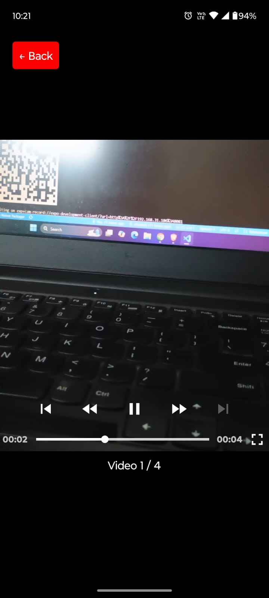

# Welcome to Cam record👋

This is an React assignment based on Expo Go.

## Extra feature

Added a feature to delete the stored videos from async storage

## Objective

The goal of this assignment is to build a React Native app that records short videos and plays them sequentially, mimicking a camcorder. The app should:

- Open the camera and record a 4-second video.
- Save and store recorded videos.
- Display another screen where all recorded videos are played sequentially, like they are appended into a single video.

## Navigation built on top of React Navigation

## Libraries

- Tailwind CSS for Styling
- react-native-vision-camera for recording the video
- react-native-video for displaying the videos
- react-native-async-storage/async-storage for Storage

## Camera UI

Implement a screen that accesses the device's camera using react-native-vision-camera.
Automatically record a 4-second video when the camera opens.
Save the recorded video to local storage.

## List of Stored Videos

Maintain a list of recorded video URIs.
Store them using React Native’s state management or AsyncStorage for persistence.

## Sequential Order

Retrieve all recorded videos.
Implement a video player using react-native-video.(or any other library)
Play the videos sequentially, one after another.

## Video Player Modal

